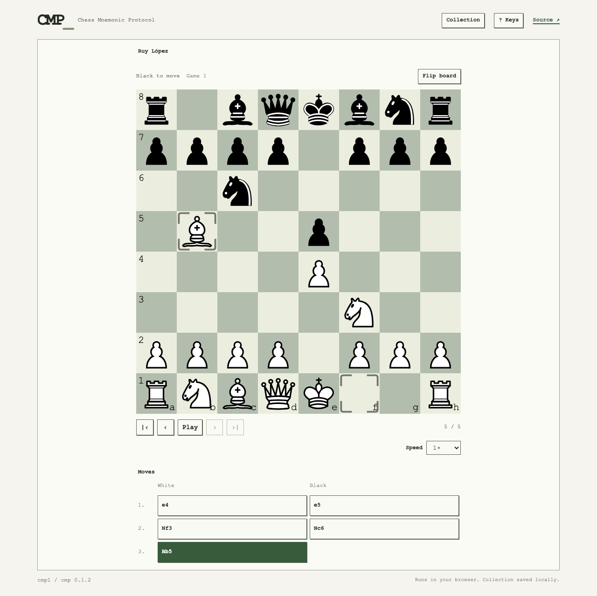

CMP Website
===========

A web interface for Chess Mnemonic Protocol (CMP).
Generate, check and replay legal moves. Export CMP, UCI, SAN or PGN.

Website: https://julesora.github.io/cmp-website/

[Phone preview](docs/mobile.png) · [Collection preview](docs/collection.png)

Layout
------

The board and moves are the main view. Open Collection to choose or manage
sequences. Selecting an entry opens it for viewing and closes Collection.
Moves sit below the board.

* New: generate or start blank, then edit. Save adds the draft to the collection.
* Import: paste text or choose a CMP/UCI file. Check, normalize, then Import.
* Edit: beside each name. Save updates that entry; Cancel restores it.
* Export: at the top of Collection. Check entries to export a batch, or export all.
* Delete: remove the entry from inside Edit.

Exports support CMP, UCI, SAN and PGN. Batch exports share one text file.
Legal destinations appear on the board when selecting a piece in Edit.
The collection is saved in this browser and survives reloads.

Setup
-----

Requires Python 3.9+ and Node 22.12+.

    python3 -m venv .venv
    .venv/bin/pip install -r requirements-dev.txt
    npm ci

Browser
-------

Build and start the preview:

    npm run build:pages
    npm run preview:pages

Open the preview URL with /cmp-website/ at the end.

This version runs CMP in your browser. The first load downloads Python
(about 13 MB). Processing works offline while the page stays open.
The collection is stored in this browser. Export a copy to keep elsewhere.

Server
------

Start the Python server:

    npm start

In another terminal, start the frontend:

    npm run dev

Open the URL shown by Vite. This version sends inputs to your local
Python server.

Test
----

Install the test browser once:

    npx playwright install chromium webkit

Test the API and server interface:

    npm run test:api
    npm test

Build and test the browser version:

    npm run build:pages
    npm run test:pages
    npm run test:mobile

Keys
----

Outside fields and controls:

* Left / Right: previous / next move
* Home / End: first / last position
* Space: play / pause
* F: flip board
* /: edit sequence
* ?: show shortcuts

Ctrl+Enter (Cmd+Enter on macOS) applies the draft. Escape cancels it.
The Keys dialog can disable F, / and ? shortcuts.

Files
-----

* server/workbench.py: shared CMP operations
* server/app.py: HTTP API
* src/main.js: interface and board controls
* src/client.js: server and browser requests
* src/collection.js: saved sequences
* src/shortcuts.js: keyboard controls
* src/worker.js: Python browser worker
* scripts/browser.py: browser runtime files
* tests/: API and browser tests

Credits
-------

* [CMP][cmp] provides the protocol and chess rules.
* [cm-chessboard][board] provides the board visualiser. MIT license.
* [Pyodide][pyodide] runs Python in the browser. MPL-2.0 license.
* [FastAPI][fastapi] serves the local API. MIT license.
* [Vite][vite] builds and serves the frontend. MIT license.

The [standard chess pieces][pieces] are by Cburnett and Rfc1394, adapted
by Stefan Haack for cm-chessboard. They use the CC BY-SA 3.0 license.
The original attribution and license are included in the SVG file.

[cmp]: https://github.com/julesora/cmp
[board]: https://github.com/shaack/cm-chessboard
[pyodide]: https://github.com/pyodide/pyodide
[fastapi]: https://github.com/fastapi/fastapi
[vite]: https://github.com/vitejs/vite

[pieces]: https://commons.wikimedia.org/wiki/Category:SVG_chess_pieces/Standard
